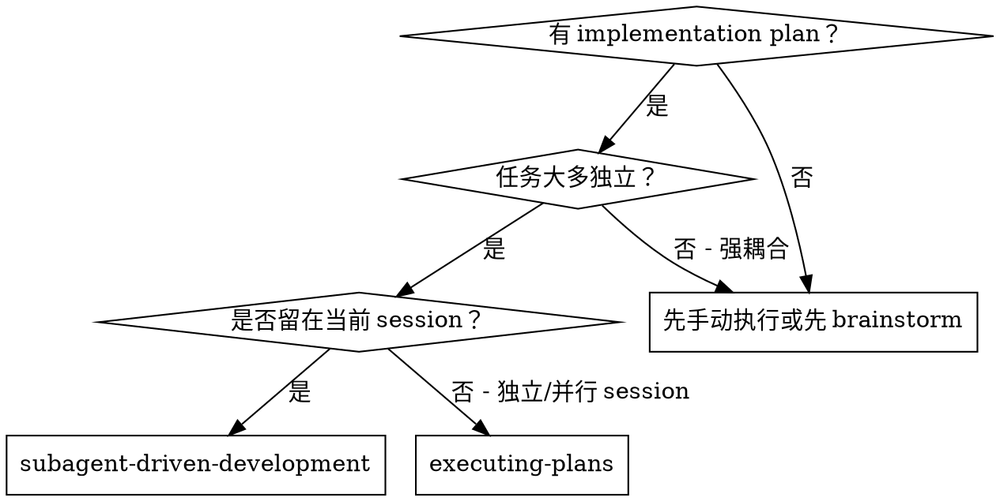
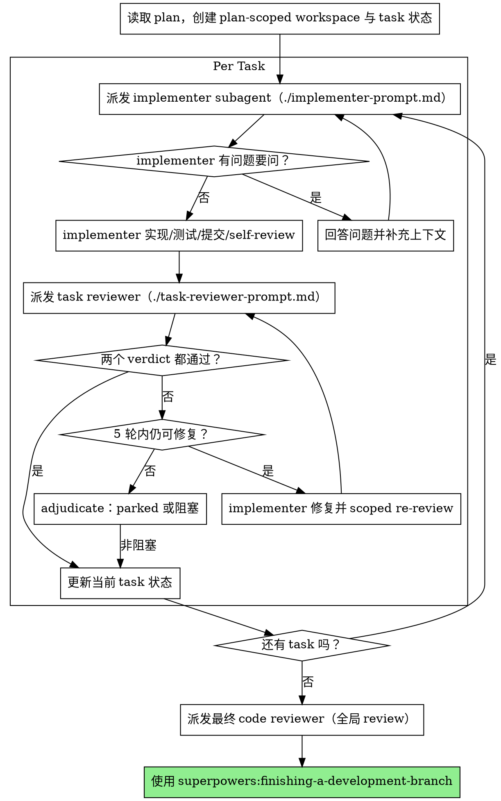

# Subagent-Driven Development

按计划执行：每个 task 派发一个全新的 implementer subagent；使用一个 task reviewer 同时返回 spec compliance 与 code quality 两个 verdict；问题修复后做 scoped re-review，全部 task 完成后再做一次 broad whole-branch review。

**核心原则：** 文件化 task brief/review package + 单 reviewer 双 verdict + 有上限的修复循环 = 可恢复、可审计的高质量迭代

## Plan-scoped 状态

每份 plan 都必须使用自己的状态目录，避免多个计划共用 ledger：

```bash
workspace=$(scripts/sdd-workspace docs/plans/feature-plan.md)
brief=$(scripts/task-brief docs/plans/feature-plan.md 1)
scripts/review-package docs/plans/feature-plan.md BASE_SHA HEAD_SHA
```

workspace 位于 `.superpowers/sdd/<plan-basename>/`，由脚本创建自忽略目录。不要把 brief、review package 或 progress ledger 写进 `.git/`，也不要让不同 plan 共用一个 progress 文件。

## Review 生命周期

1. implementer 使用 `task-brief` 提供的单 task 内容实现、测试并自审。
2. task reviewer 读取 `review-package`，输出 `SPEC_COMPLIANCE` 和 `QUALITY` 两个独立 verdict；reviewer 只读，不修改工作树。
3. 有 Critical/Important 或 spec 缺口时，由 controller 派发修复；前 3 轮尽量恢复原 implementer，后 2 轮换用新的、更强的 implementer。
4. 最多 5 轮修复/re-review。达到上限后必须 adjudicate：非阻塞建议标记 `PARKED`，load-bearing 问题保持阻塞，不能无限重试。
5. 所有 task 通过后，执行一次 broad whole-branch review；修复后只对 broad findings 做 scoped re-review，再进入 `finishing-a-development-branch`。

详见：
- `task-reviewer-prompt.md`
- `re-review-prompt.md`
- `scripts/task-brief`
- `scripts/review-package`
- `scripts/sdd-workspace`

## When to Use



**对比 Executing Plans（独立 session）：**
- 同一 session（无上下文切换）
- 每 task 新 subagent（避免上下文污染）
- 每 task 由一个 reviewer 返回两个独立 verdict，并按需 scoped re-review
- 迭代更快（task 之间无需人类中断）

## The Process



## Prompt Templates

- `./implementer-prompt.md`：派发 implementer subagent
- `./task-reviewer-prompt.md`：派发只读 task reviewer，同时返回两个 verdict
- `./re-review-prompt.md`：只验证上一轮修复的 scoped re-review
- `./spec-reviewer-prompt.md`、`./code-quality-reviewer-prompt.md`：旧路径兼容入口，不再作为主流程的两个独立阶段

## Example Workflow

```
你：我正在使用 Subagent-Driven Development 来执行这个计划。

[只读一次计划文件：docs/plans/feature-plan.md]
[使用 task-brief 提取每个 task 的最小上下文]
[创建 plan-scoped workspace，并建立当前 session 的 task 状态]

Task 1：安装 hook 脚本

[拿到 Task 1 原文与上下文（已提前提取）]
[派发 implementer subagent，附上完整 task 文本 + 上下文]

Implementer：“开始前确认下：hook 应该安装在 user 级还是 system 级？”

你：“user 级（~/.config/superpowers/hooks/）”

Implementer：“收到，开始实现……”
[稍后] Implementer：
  - 实现 install-hook 命令
  - 添加测试，5/5 通过
  - 自检（self-review）：发现漏了 --force flag，已补上
  - 已提交

[派发 task reviewer]
Task reviewer：SPEC_COMPLIANCE: PASS；QUALITY: PASS

[标记 Task 1 完成]

Task 2：Recovery modes

[派发 implementer subagent]
Implementer：[无问题，直接做]
Implementer：
  - 新增 verify/repair modes
  - 8/8 tests 通过
  - 自检（self-review）：OK
  - 已提交

[派发 task reviewer]
Task reviewer：
  SPEC_COMPLIANCE: FAIL（缺失进度汇报，多做 --json flag）
  QUALITY: FAIL（magic number 100）

[implementer 修复并执行 scoped re-review]
Task reviewer：SPEC_COMPLIANCE: PASS；QUALITY: PASS

[标记 Task 2 完成]

...

[全部 tasks 完成后]
[派发最终 code-reviewer]
Final reviewer：需求满足，可以合并

完成！
```

## Advantages

**对比手动执行：**
- subagent 更自然地遵循 TDD
- 每 task 新上下文（不混淆）
- 并行安全（subagent 不互相干扰）
- subagent 可在开工前或过程中提问

**对比 Executing Plans：**
- 同一 session（无需交接）
- 持续推进（无需等待）
- review checkpoint 自动化

**效率收益：**
- controller 不用重复读文件（一次提取，持续复用）
- controller 精选并提供最需要的上下文
- subagent 一开始就拿到完整信息
- 问题在开工前暴露（不是做完才发现）

**质量闸门（Quality gates）：**
- self-review 先抓一轮问题
- 一个 task reviewer 同时检查 spec compliance 与 code quality
- scoped re-review 确保修复真的生效
- 五轮 circuit breaker 防止无限循环
- broad whole-branch review 捕获跨 task 问题

**成本：**
- 每 task 至少包含 implementer 与 reviewer
- controller 需要维护 plan-scoped 状态和 review package
- 修复循环会增加迭代次数，但有明确上限

## Red Flags

**Never：**
- 跳过 review（两个 verdict 任意一类）
- 带着未修复问题继续推进
- 并行派发多个 implementer（会冲突）
- 让 subagent 自己读整份 plan（应提供 task brief）
- 跳过 scene-setting 上下文（subagent 需要理解任务放在哪）
- 忽略 subagent 的问题（先回答再让其继续）
- 对 spec compliance 接受“差不多”（reviewer 找到问题 = 还没完成）
- 跳过 review loop（reviewer 找到问题 → implementer 修 → 必须再审）
- 用 implementer 的 self-review 替代真正的 review（两者都需要）
- **在 spec compliance ✅ 之前就做 code quality review**（顺序错误）
- 当任一 review 还有 open issues 时就进入下一个 task

**如果 subagent 提问：**
- 回答清晰、完整
- 需要时补上下文
- 不要催促其跳过理解直接开写

**如果 reviewer 提问题：**
- implementer（同一个 subagent）修复
- reviewer 复审
- 重复直到通过
- 不要跳过 re-review

**如果 subagent 失败：**
- 派发 fix subagent，给具体指令
- 不要自己手动修（避免上下文污染）

## Integration

**必需的 workflow skills：**
- `superpowers:writing-plans`：生成要执行的计划
- `superpowers:requesting-code-review`：reviewer subagent 的模板/规范
- `superpowers:finishing-a-development-branch`：全部任务完成后的收尾

**subagent 应使用：**
- `superpowers:test-driven-development`：每个 task 遵循 TDD

**替代 workflow：**
- `superpowers:executing-plans`：适用于独立/并行 session
